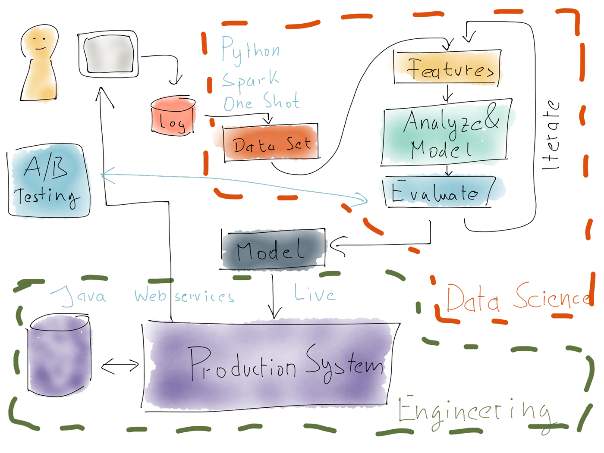

# Interesting Insights 
In this document, we list interesting and insightful points from related work.

## Supporting Fast Iteration in Model Building
- Although the modeling process is iterative, current tolls are optimized for individual models as opposed to modeling sessions.
- The primary goals of a system optimized for iteration are two fold:
	- make it cheap to run modeling experiments (with respect to time and computation)
	- provide means to manage the process by tracking experiments and allowing meta-analysis

## What is hardcore data science in practice
From the blog post by Zalando: https://www.oreilly.com/ideas/what-is-hardcore-data-science-in-practice

Pipeline is usually done in a one-off fashion:
- "This pipeline is usually done in a one-off fashion, often with the data scientist manually going through the individual steps, using a programming language like Python, that comes with many libraries for data analysis and visualization. Depending on the size of the data, one may also use systems like Spark or Hadoop, but often the data scientist will start with a subset of the data first."

The following paragraph could be part of the motivation for our work:
- The main reason for starting small is that the process is not done just once and it is iterated many times.
The pipeline is iterated and improved many times trying out different features , different forms of preprocessing, different learning methods, or maybe going back to the source and trying to add more data sources. The whole process is inherently iterative, and often highly explorative. Once the performance looks good, one is ready to try the method on real data. 

Once the pipeline and model are made there are used in the production system.
Figure below shows the interaction between the data science and data engineering aspects.

